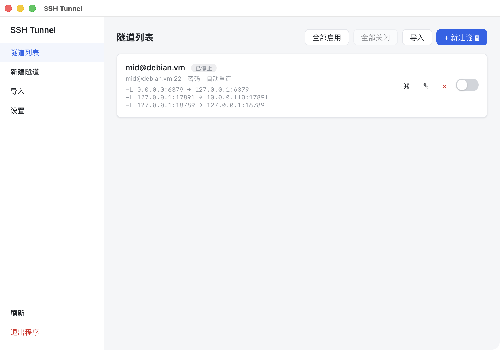
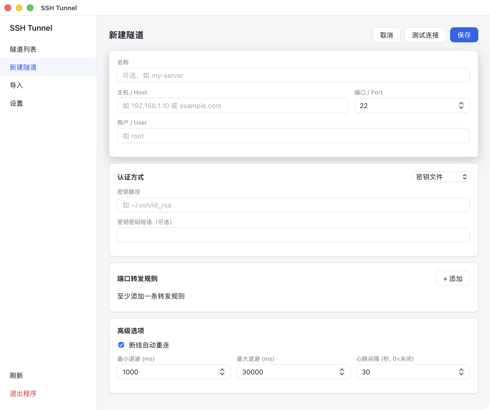
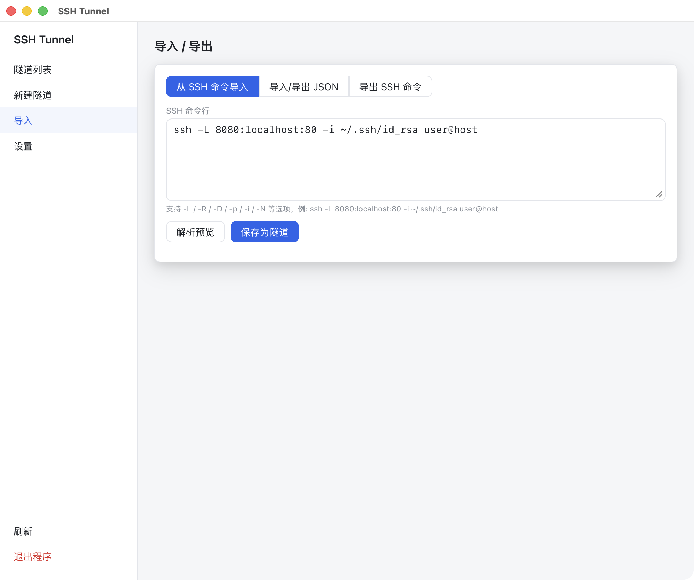
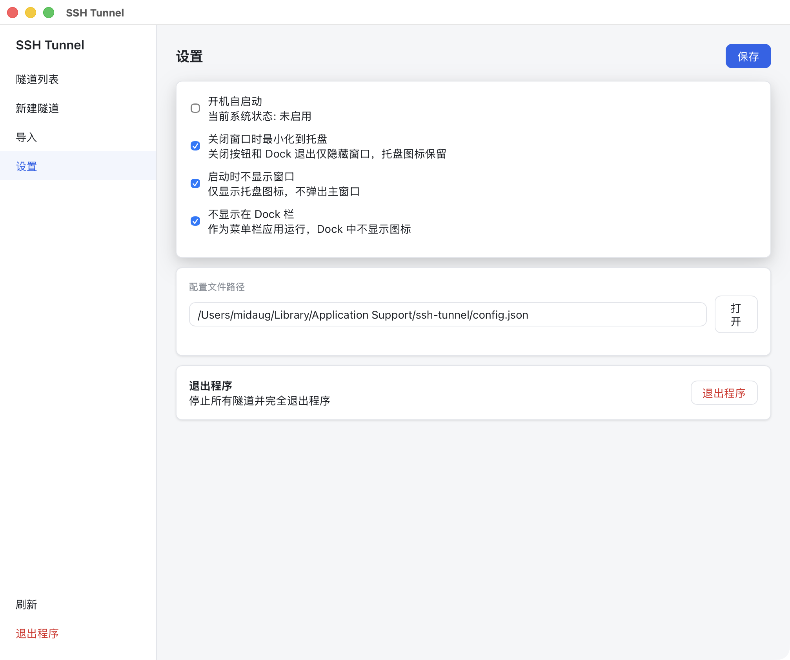
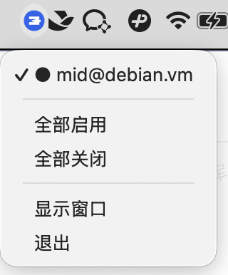

<div align="center">

# SSH Tunnel

**一个跨平台的 SSH 端口转发管理工具**

基于 Wails v2 + Vue 3 构建，用图形界面管理多条 SSH 隧道，支持系统托盘常驻、自动重连、命令行导入导出。

[功能特性](#功能特性) · [界面预览](#界面预览) · [快速开始](#快速开始) · [构建](#构建) · [技术栈](#技术栈)

</div>

---

## 功能特性

### 隧道管理

- **多隧道同时管理** — 每条隧道独立启停，状态实时同步
- **三种端口转发模式**
  - `-L` 本地转发（Local Forward）
  - `-R` 远程转发（Remote Forward）
  - `-D` 动态代理（Dynamic Forward）—— 同一监听端口同时兼容 SOCKS5 与 HTTP 代理，按首字节自动识别协议；HTTP 模式支持 `CONNECT` 隧道（HTTPS / 任意 TCP）与普通请求转发，并复用 keep-alive 连接
- **代理中转** — 到 SSH 服务器的连接可经由 HTTP / HTTPS / SOCKS5 代理建立，适用于处于内网或需跳板访问 SSH 的场景；支持代理认证，连接测试同样走代理
- **自动重连** — 断线后自动重试，可配置退避策略（初始 / 最大退避间隔）
- **连接测试** — 保存前先测试 SSH 连通性，不实际启动转发
- **一键全部启用 / 全部关闭**

### 系统托盘

- **状态指示** — 每条隧道用符号标识当前状态：
  - `●` 运行中
  - `◐` 连接中
  - `⚠` 错误
  - `○` 已停止
- **双色图标** — 有隧道运行时图标为蓝色，全部停止时自动变灰，一眼可知总体状态
- **托盘操作** — 直接在托盘菜单中启停隧道、全部启用/关闭、显示窗口、退出程序

### 导入 / 导出

- **从 SSH 命令导入** — 粘贴 `ssh -L 8080:localhost:80 -i ~/.ssh/id_rsa user@host`，自动解析为隧道配置
- **导出为 SSH 命令** — 将任意隧道一键导出为等效的 ssh 命令行，方便复制到终端使用
- **JSON 导入导出** — 支持合并 / 覆盖两种模式，方便备份和迁移

### 平台适配

| 功能 | macOS | Windows |
|------|:-----:|:-------:|
| 系统托盘 | ✅ | ✅ |
| 开机自启 | ✅ LaunchAgent | ✅ 注册表 |
| 隐藏 Dock 图标 | ✅ 菜单栏应用模式 | — |
| 启动时不显示窗口 | ✅ | ✅ |
| 关闭窗口最小化到托盘 | ✅ | ✅ |
| 原生图标 | ✅ | ✅ ICO |

## 界面预览

### 隧道列表

主界面展示所有隧道配置，含运行状态、转发规则、错误信息，可一键启停。



### 新建 / 编辑隧道

配置 SSH 连接信息、认证方式（密钥 / 密码）、端口转发规则及高级选项。



### 导入 / 导出

支持从 SSH 命令导入、JSON 导入导出、导出为 SSH 命令三种方式。



### 设置

开机自启、窗口行为、Dock 显示等全局配置。



### 系统托盘

托盘菜单可直接操作隧道，图标颜色反映整体运行状态。



## 快速开始

### 环境要求

- **Go** 1.21+
- **Node.js** 16+
- **[Wails CLI v2](https://wails.io/docs/gettingstarted/installation)**

```bash
go install github.com/wailsapp/wails/v2/cmd/wails@latest
```

<details>
<summary>平台额外依赖</summary>

- **macOS**：Xcode Command Line Tools
  ```bash
  xcode-select --install
  ```
- **Windows**：[WebView2 Runtime](https://developer.microsoft.com/microsoft-edge/webview2/)（Win10/11 通常已内置）+ C 编译器（TDM-GCC / MSYS2）

</details>

### 本地开发

```bash
# 克隆仓库
git clone https://github.com/midaug/ssh-tunnel.git
cd ssh-tunnel

# 安装前端依赖
cd frontend && npm install && cd ..

# 热重载开发模式
wails dev
```

开发模式下前端改动即时热更新，同时可在浏览器访问 `http://localhost:34115` 调试。

## 构建

```bash
# 构建当前平台
wails build -clean

# 交叉编译 Windows（需在对应平台或配置交叉编译工具链）
wails build -platform windows/amd64 -clean

# 交叉编译 macOS
wails build -platform darwin/universal -clean
```

构建产物输出到 `build/bin/` 目录。

## 技术栈

| 层 | 技术 |
|----|------|
| 框架 | [Wails v2](https://wails.io) — Go + WebView 桌面框架 |
| 后端 | Go，[golang.org/x/crypto/ssh](https://pkg.go.dev/golang.org/x/crypto/ssh)，[golang.org/x/net/proxy](https://pkg.go.dev/golang.org/x/net/proxy) |
| 前端 | Vue 3 + TypeScript + Pinia + Vue Router |
| 系统托盘 | [fyne.io/systray](https://github.com/fyne-io/systray) |
| macOS Dock | cgo 调用 `NSApp.setActivationPolicy` |
| 开机自启 | macOS LaunchAgent / Windows 注册表 / Linux .desktop |

## 项目结构

```
ssh-tunnel/
├── main.go                     # 应用入口，Wails 配置，托盘回调
├── app.go                      # 前端绑定方法
├── wails.json                  # Wails 项目配置
├── internal/
│   ├── config/                 # 配置持久化、SSH 命令解析与导出
│   │   ├── model.go            # 数据模型
│   │   ├── store.go            # JSON 配置读写
│   │   ├── parser.go           # ssh 命令 → 隧道配置
│   │   └── ssh_export.go       # 隧道配置 → ssh 命令
│   ├── tunnel/                 # SSH 隧道运行时管理
│   │   ├── manager.go          # 多隧道管理器
│   │   ├── tunnel.go           # 单隧道生命周期、自动重连
│   │   ├── proxy.go            # 经 HTTP/HTTPS/SOCKS5 代理拨号 SSH 服务器
│   │   ├── forward_local.go    # -L 本地转发
│   │   ├── forward_remote.go   # -R 远程转发
│   │   └── forward_dynamic.go  # -D 动态转发（SOCKS5 + HTTP 代理）
│   ├── tray/                   # 系统托盘（跨平台图标）
│   ├── dock/                   # macOS Dock 显示控制
│   └── autostart/              # 开机自启（macOS/Linux/Windows）
├── frontend/
│   └── src/
│       ├── App.vue             # 主布局 + 侧边栏
│       ├── views/              # 隧道列表 / 编辑 / 导入导出 / 设置
│       ├── stores/             # Pinia 状态管理
│       └── style.css           # 全局样式
├── build/
│   ├── appicon.png             # 应用图标（1024×1024）
│   ├── darwin/                 # macOS Info.plist
│   └── windows/                # Windows ICO + manifest
└── images/                     # README 截图
```

## 配置文件

配置自动持久化到用户配置目录：

| 平台 | 路径 |
|------|------|
| macOS | `~/Library/Application Support/ssh-tunnel/config.json` |
| Windows | `%AppData%\ssh-tunnel\config.json` |
| Linux | `~/.config/ssh-tunnel/config.json` |

可在「设置」页面查看完整路径并直接打开所在文件夹。

## 系统要求

| 平台 | 最低版本 | 备注 |
|------|---------|------|
| macOS | 10.13 High Sierra | — |
| Windows | 10 / Server 2016 | 需 WebView2 Runtime；Win7/8 不受支持 |

> ⚠️ **关于 Windows 7**：Wails v2 依赖 WebView2（Edge 内核），且 Go 1.21+ 已移除 Win7 支持，因此无法在 Win7 上运行。

## License

[MIT](LICENSE)
